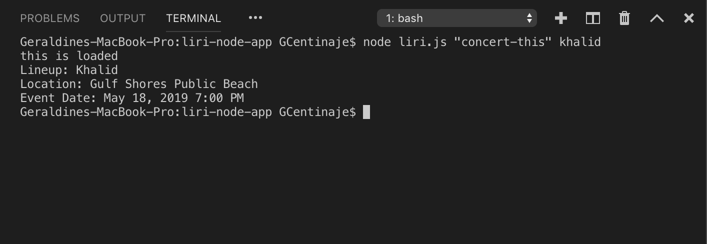
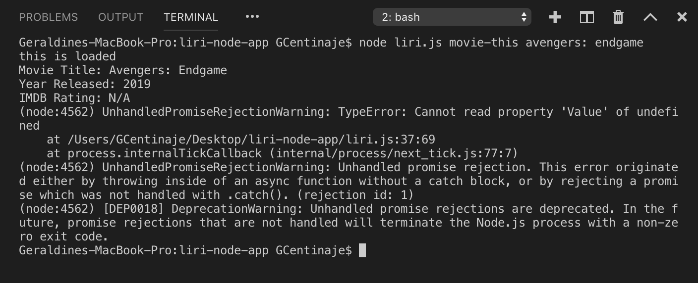
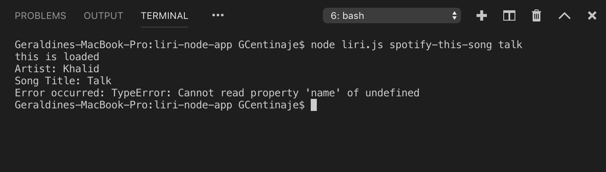
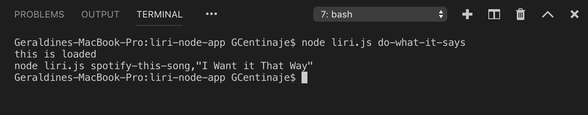

# liri-node-app

### Overview
LIRI is a _Language_ Interpretation and Recognition Interface. LIRI will be a command line node app that takes in parameters and gives you back data.

### Instructions
1. Open your terminal/bash window in the directory of the files you would like to run.

2. In the command line of your terminal/bash, type: `node liri.js [command] [search]`.

3. You have four options provided to input for [command] followed by its appropriate [search].

4. The four options for [command] are as follows:
    
    * "concert-this" command will search the nearest concert date and location of today's artist you input for [search]. 

    * "movie-this" command will provide the information for the movie title you input for [search].
        
    
    * "spotify-this-song" command provide information for the song title you input for [search].
        

    * "do-what-it-says" command will provide a random command line from the 'random.txt' file.
    